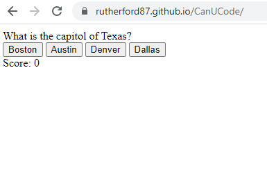

# CanUCode

Contents of repo:
* index.html
* style.css
* Example image
* README.md

This is my working example of a quiz, with three questions, and a timer. The timer will end the game if you run out of time.

The repo can be found here: 
[TPR_GitHub](https://github.com/rutherford87/CanUCode)

The website can be viewed here: [Austin's Hardest Quiz](https://rutherford87.github.io/CanUCode/)

Here is a screenshot of the thrilling quiz:

This was challenging but enjoyable. 

Good luck, have fun!
Updated 4/28/2021 for directory test.